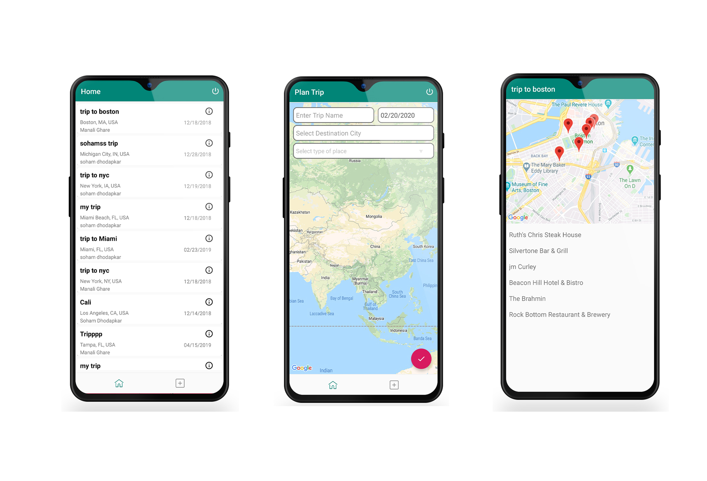

# Trip-Planner
Trip planner application uses Google Authentication to manage multiple users. User can create trip plans and can see the trips of another user. It uses firebase storage to save the trip data and Google Places Api to search cities.

